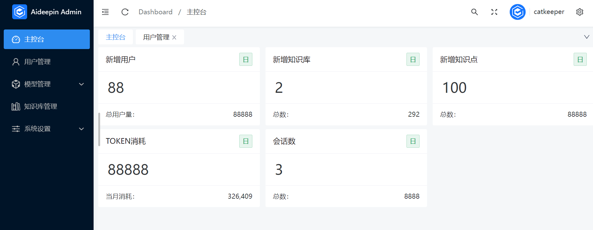
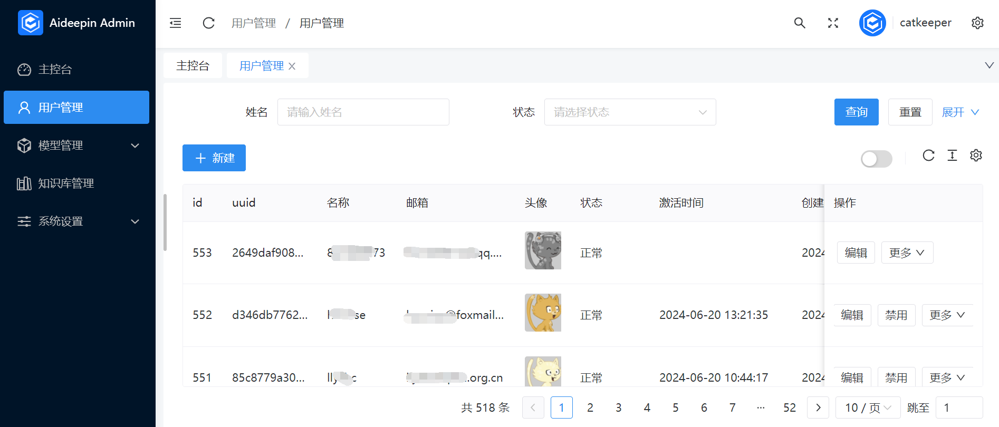
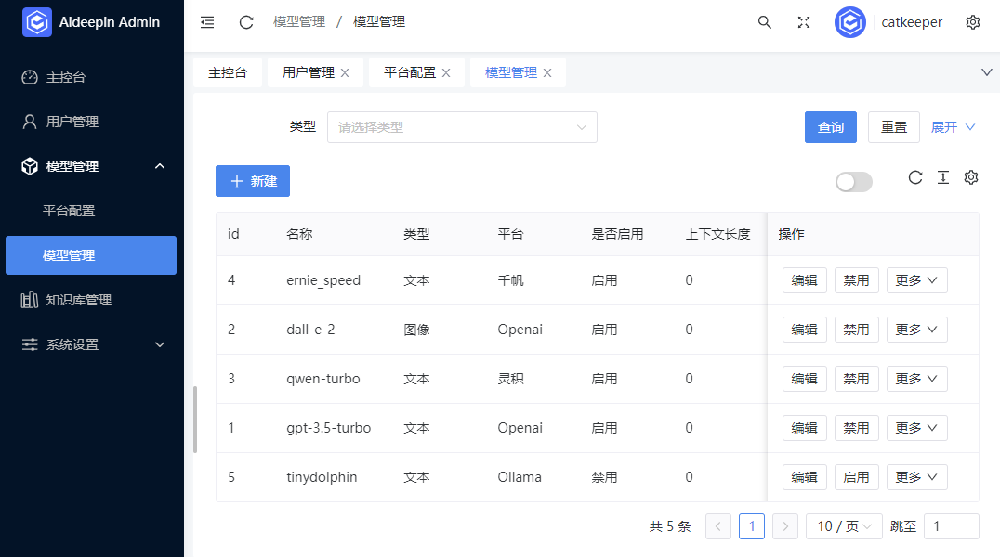
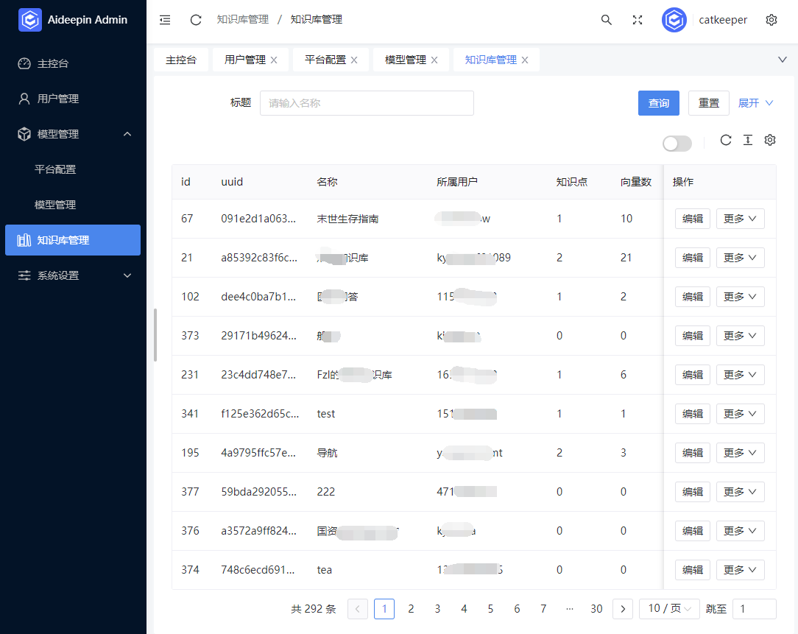
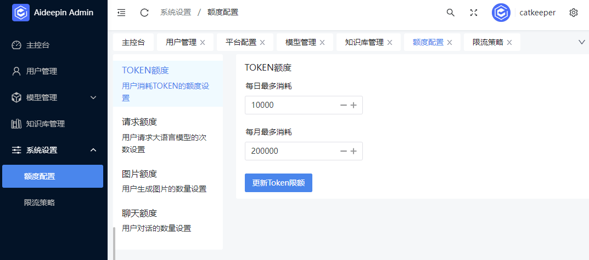

## 简介

本仓库为langchain4j-aideepin的管理后台WEB端，基于[naive-ui-admin](https://github.com/jekip/naive-ui-admin)

👉[详细文档](https://github.com/moyangzhan/langchain4j-aideepin/wiki)

默认管理员账号：catkeeper@aideepin.com 密码：123456

本项目仓库地址：[github](https://github.com/moyangzhan/langchain4j-aideepin-admin) [gitee](https://gitee.com/moyangzhan/langchain4j-aideepin-admin)

关联项目

* 后端服务 langchain4j-aideepin:
  * [github](https://github.com/moyangzhan/langchain4j-aideepin)
  * [gitee](https://gitee.com/moyangzhan/langchain4j-aideepin)
* 用户端WEB langchain4j-aideepin-web:
  * [github](https://github.com/moyangzhan/langchain4j-aideepin-web)
  * [gitee](https://gitee.com/moyangzhan/langchain4j-aideepin-web)

## 功能

用户管理

模型管理

知识库管理

系统配置

## 前置要求

### Node

`node` 需要 `^16 || ^18 || ^19` 版本

```shell
node -v
```

### PNPM

如果你没有安装过 `pnpm`

```shell
npm install pnpm -g
```

## 安装依赖

根目录下运行以下命令

```shell
pnpm bootstrap
```

## 本地环境开发

1、修改根目录下 `.env` 文件中的 `VITE_GLOB_API_URL` 为你的实际后端口地址

2、根目录下运行以下命令

```shell
pnpm dev
```

## 正式环境

### 发布方式1 - Docker

待办

### 发布方式2 - 手动打包

1、 nginx配置

服务器上nginx的配置可以参考根目录下的 `nginx.conf` 文件，将 `proxy_pass http://localhost:9999/;` 中的 `localhost:9999`改成后端服务对应的ip及端口

2、根目录下运行以下命令，[参考信息](https://cn.vitejs.dev/guide/static-deploy.html#building-the-app)

```shell
pnpm build
```

3、将 `dist` 文件夹内的文件复制到网站服务的根目录下

网站服务的根目录：`nginx.conf` 的 `location /` 设置的目录

## 浏览器支持

本地开发推荐使用 `Chrome 80+` 浏览器

支持现代浏览器, 不支持 IE

|  IE |  Edge | Firefox | Chrome | Safari |
| :------------------------------------------------------------------------------------------: | :----------------------------------------------------------------------------------------------: | :---------------------------------------------------------------------------------------------------------: | :-----------------------------------------------------------------------------------------------------: | :-----------------------------------------------------------------------------------------------------: |
|                                         not support                                         |                                         last 2 versions                                         |                                               last 2 versions                                               |                                             last 2 versions                                             |                                             last 2 versions                                             |

## 截图

首页


用户管理


模型管理


知识库管理


系统设置

